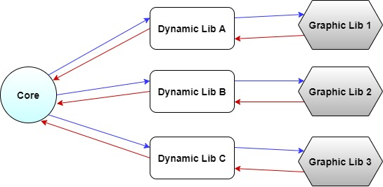
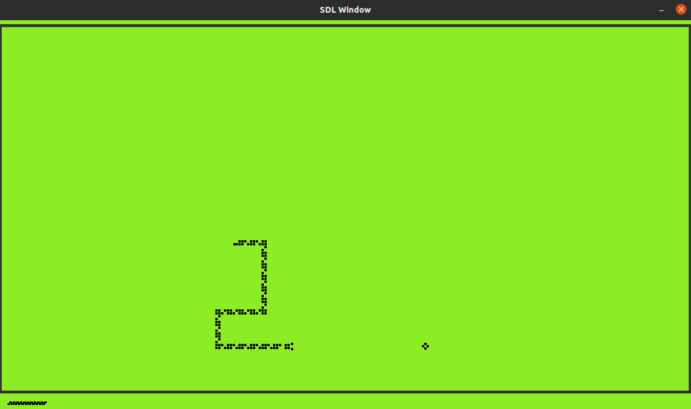
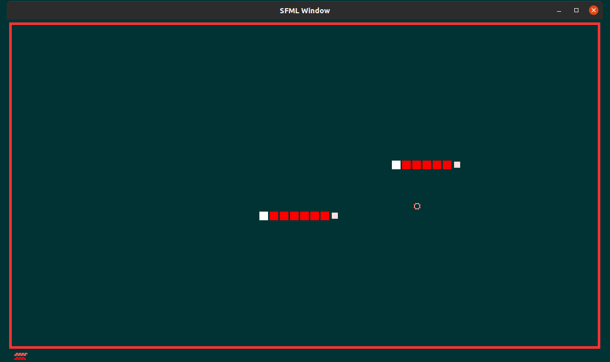

# Nibbler

Nibbler is yet another snake video game written in C++ including a major twist: dynamiclibraries.
The goal is splitted in 4 parts: a main executable and 3 dynamic libraries that the main executable will load and use at runtime.
Each library will embed everything your main executable might need to display the game and to getthe player’s inputs.
The main executable will only focus on the game logic and interact with the dynamic libraries.
The main executable must interact in a identical way with any libraries.

__NOTE:__
It is forbidden to include any library that you did not write yourself. About this, a script must be provided to set up your environment, download and install dependencies.
Each available GUI and input handler for your game must only exist in a dynamic library that will be loaded and used dynamically.
It is strictly forbidden to reference a graphic library in the main program.
The main executable must at least accept as parameters the game area’s width and height.
The ABI used to load and use dynamic libraries atruntime isC, not C++. As a consequence, special constructs must be used.
No texture has been used, everything is drawn through pixel arrays calculated at execution time. 

__Realized options:__
- Multiple game modes (Increasing speed, disappearing food, super food, score and obstacles)
- Sounds (Through a dynamic library)
- Local Multiplayer (Two snakes fighting for the same food)

  

_For this project I decided to make all files public but please do not hesitate to contact me if need additional details._
